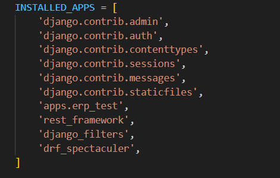
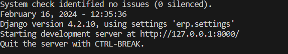
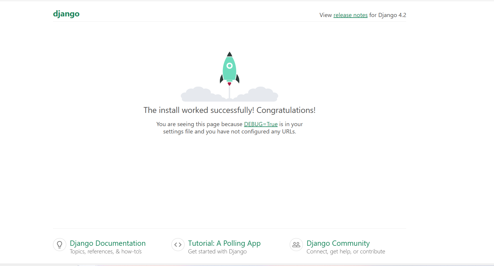
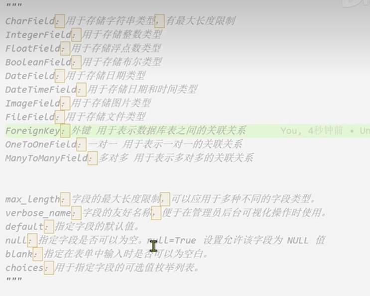

### 一、创建项目环境和python虚拟环境

1.1创建虚拟环境
```
python -m venv erp_venv
```
1.2激活虚拟环境
先进入虚拟环境的目录下
```
cd .\erp_venv\    // 进入虚拟环境目录
.\Scripts\activate  // 激活虚拟环境
```
1.3安装django和drf
```
pip install django
pip install djangorestframework //提供工具
pip install django-filter
pip install drf_spectacular  //自动生成aip 规范文档

```
### 二、创建项目和Django APP
2.1创建项目erp和app
```
django-admin startproject erp
// 在erp目录下创建apps，进入apps

```
2.2创建app
```
// 在apps中创建app
cd apps
django-admin startapp test_app
// 在apps.py 文件中修改name变量
name = 'apps.erp_test'  //在class ErpTestConfig(AppConfig)

//如果不在apps目录下
python manage.py startapp erp_test
```
### 三、配置setting.py和启动项目
3.1配置setting.py
在erp目录下进入setting.py文件中导入app和库

```
//合并数据库
python manage.py makemiapp erp_testgrations
 python manage.py migrate
 //启动项目
 python manage.py runserver
```
点击网址可出现
 
 

### 四、Django构建数据表示例
4.1产品分类表

在apps.erp_test.models.py中创建模型

```
from django.db.models import *

## 产品分类表 

class Goods(Model):
    name =CharField(max_length=64,verbose_name='分类名字')
    remark =CharField(max_length=64,null=True,verbose_name='备注',blank=True)

## 产品表
    
class Goods(Model):
    number=CharField(max_length=32,verbose_name='产品编号')
    name=CharField(max_length=64,verbose_name='产品名称')
    barcode =CharField(max_length=32,null=True,blank=True,verbose_name='条形码')
    spec=CharField(max_length=64,null=True,blank=True,verbose_name='规格')
    shelf_life_days=IntegerField(null=True,verbose_name='保质期天数')
    purchase_price=FloatField(default=0,verbose_name='采购价')
    retail_price=FloatField(default=0,verbose_name='零售价')
    remark=CharField(max_length=256,null=True,blank=True,verbose_name='备注')

```
生成迁移脚本并合并数据库
```
python manage.py makemigrations
python manage.py migrate
//执行
python manage.py runserver
```
Django常用字段讲解


### 五、引入admin和管理员

